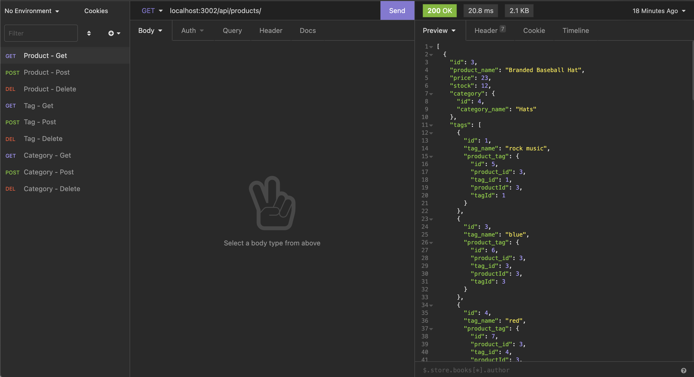

# E-commerce
 DESCRIPTION
 
 This project is run on the back end using node.js and is a database that helps manage inventory.
 
 I'm still currently trying to get the product Post and the Category Post to work, but here is what I do have for now.
 
 Link to walkthrough: https://drive.google.com/file/d/1xHsngLJZ_apkO3TYNW48JtaAd59sWHqT/view?usp=sharing

Here is a screenshot of the inventory in Insomnia
 

